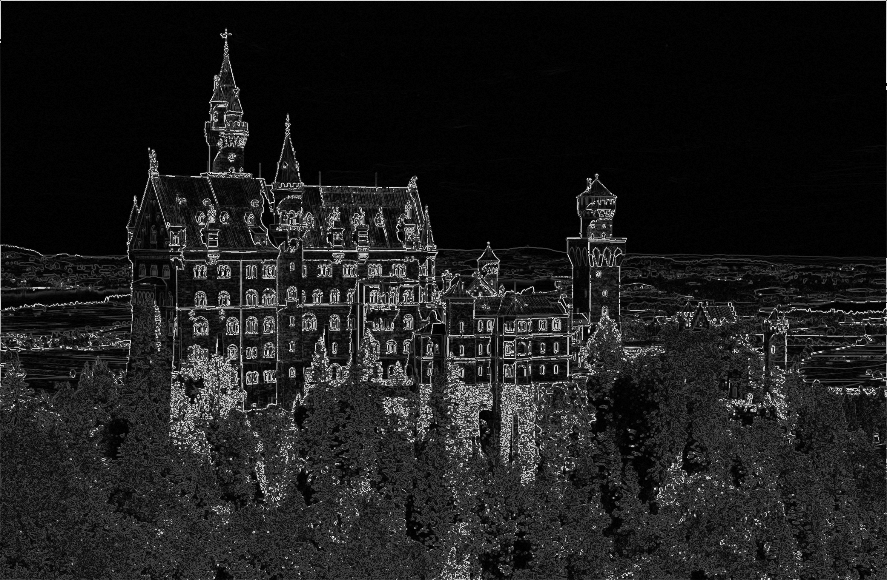
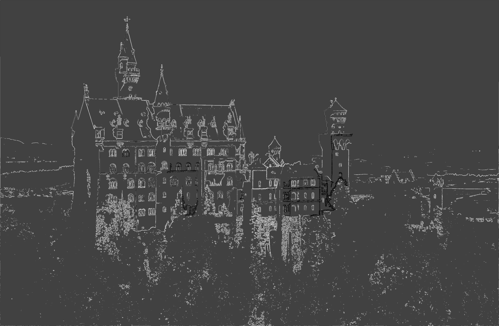
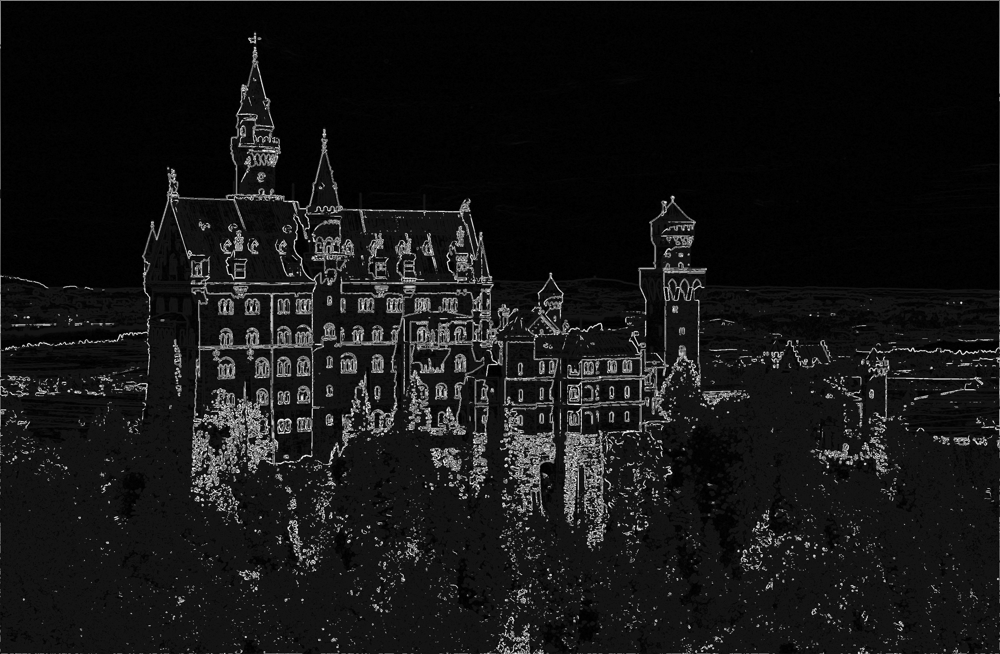
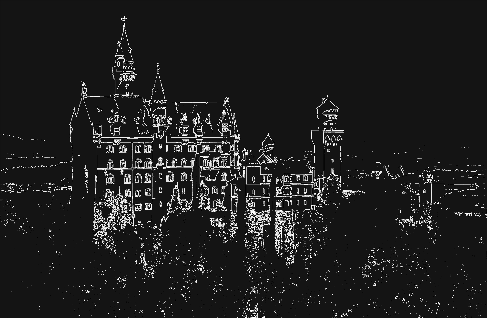
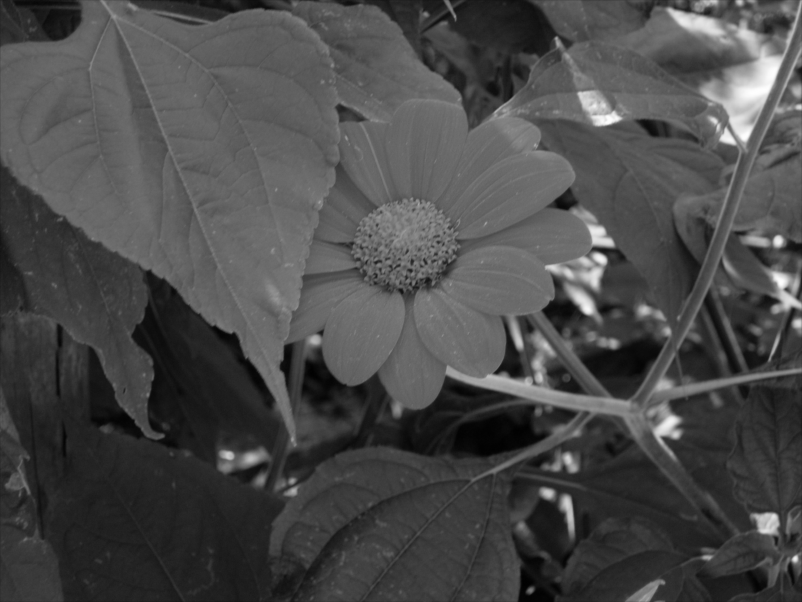
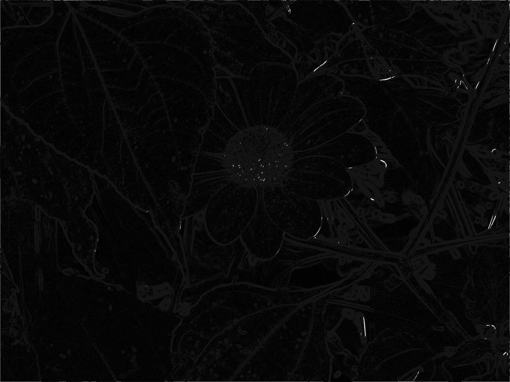
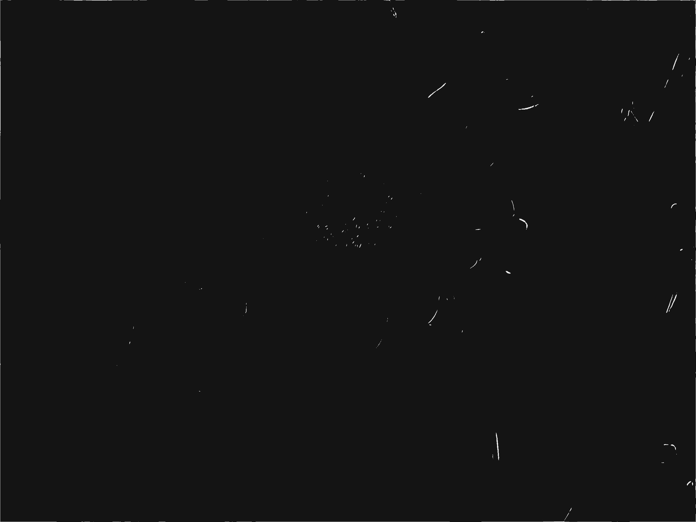

# ImageSegmentation

**Uppgift 2 för Avancerade metoder för text och bildbehandling (DA357A)**  
Kalle Bornemark - 861209-3917  
Jimmy Maksymiw - 891031-1730

---

## Programbeskrivning

Detta program är konstruerat i syfte att lära oss hur man manipulerar bilder i Java och förser användaren med följande funktionalitet:

  * Gråskala
  * Gaussian blur
  * Motions blur
  * Konturdetektering med Sobel-kärna
  * Segmentering med tröskelvärde

---

## Testfall

### Test 1: Segmentering med tröskelvärde
Målet med detta test är att isolera ut segment ur en bild på ett så rent sätt som möjligt.

De tröskelvärden som behöver sättas är:
* segThres: Hur stor skillnad det får vara i färgvärden inom samma segment
* segMin: Minimalt antal pixelar i samma segment för att en separat bild skall genereras
* segMax: Maximalt antal pixelar i samma segment för att en separat bild skall genereras

Förväntad utdata:
1. En bearbetat bild där segmenten är förtydligade med hjälp av tröskelvärden
2. Separata bilder för alla segment som uppfyller de satta storlekskraven

##### Indata
* Bild: 
  
* segThres: 120
* segMin: 1000
* segMax: 6000

##### Resultat
  
Dessutom genereras separata bilder för varje segment (enskilda glödlampor i detta fall). Två exempel:

  

### Test 2: Gråskala och Gaussian Blur
Här testar vi omvandlingen till gråskala och appliceringen av Gaussian Blur.

Inga tröskelvärden behöver sättas.

Förväntad utdata:
1. Indatabild omgjord till gråskala
2. Ovanstående bild med applicerad Gaussian Blur

##### Indata
* Bild: 
  

##### Resultat
1:   
2:   

### Test 3.1: Konturdetektering med Sobelkärna och förfining genom segmentering
Målet med detta test är att få fram tydliga konturer från resultatbilden i Test 2. Detta görs genom att applicera två Sobel-kärnor som itererar igenom samtliga pixlar i bilden (vertikalt och horisontellt). Sedan förfinas konturerna genom att köra bilden genom segmenteringsproceduren.

Två tröskelvärden behöver sättas:
* Räckviddströskel för pixelintensiteten, avgör hur stark intenitet varje pixel måste ha för att räknas som en kontur
* Ett tröskelvärde för hur stora färgskillnader pixlar får ha för att räknas in i samma segment 

Förväntad utdata:
1. Resultatbild från Test 2 med applicerad Sobel-kärna som framhäver konturerna
2. Ovanstående bild med förfinade konturer genom segmenteringsprocessen

##### Indata
* Bild: 
  
* sobelThres: 100
* segThres: 80

##### Resultat
1:   
2:   

### Test 3.2: Konturdetektering med Sobelkärna och förfining genom segmentering (forts.)
Detta test är en förlängning av Test 3.1 och utförs därför på samma vis fast med andra tröskelvärden.

##### Indata
* sobelThres: 65
* segThres: 100

##### Resultat
1:   
2:   

### Test 3.3: Konturdetektering med Sobelkärna och förfining genom segmentering (forts.)
Detta test är en förlängning av Test 3.1 och utförs därför på samma vis fast med andra tröskelvärden.

##### Indata
* sobelThres: 20
* segThres: 130

##### Resultat
1:   
2:   

### Test 4: Konturdetektering med Sobelkärna och förfining genom segmentering (forts.)
Med detta test vill vi visa på att lämpliga tröskelvärden för en bild inte nödvändigtvis fungerar för en annan. 

##### Indata
* Bild: Denna bild är förbehandlad med gråskala och Gaussian Blur 

* sobelThres: 20
* segThres: 130

##### Resultat
1:   
2:   
