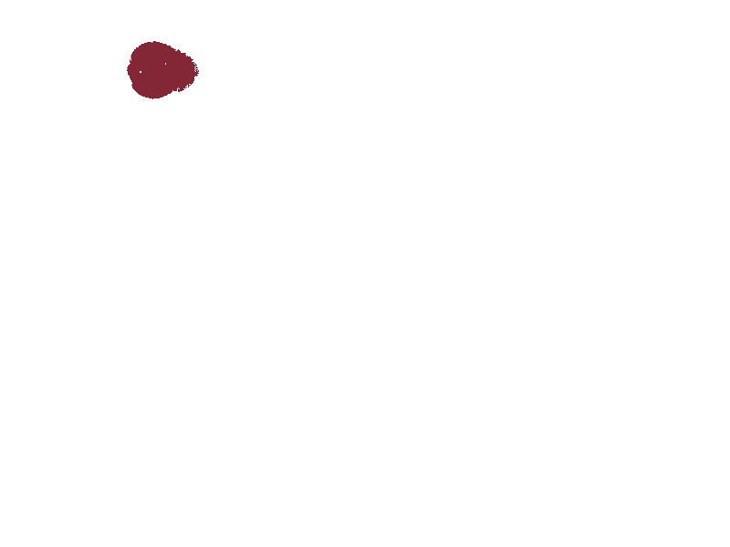
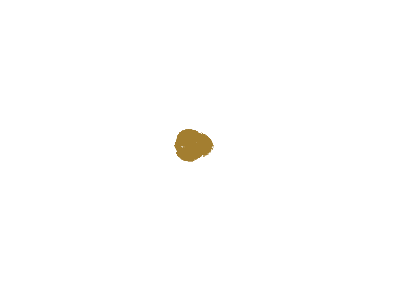

# ImageSegmentation

**Uppgift 2 för Avancerade metoder för text och bildbehandling (DA357A)**  
Kalle Bornemark - 861209-3917  
Jimmy Maksymiw - 891031-1730

---

## Programbeskrivning

Detta program är konstruerat i syfte att lära oss hur man manipulerar bilder i Java och förser användaren med följande funktionalitet:

  * Gråskala
  * Gaussian blur
  * Motions blur
  * Konturdetektering med Sobel-kärna
  * Segmentering med tröskelvärde

---

## Testfall

### Test 1: Segmentering med tröskelvärde
Målet med detta test är att isolera ut segment ur en bild på ett så rent sätt som möjligt.

De tröskelvärden om behöver sättas är:
* segThres: Hur stor skillnad det får vara i färgvärden inom samma segment
* segMin: Minimalt antal pixelar i samma segment för att en separat bild skall genereras
* segMax: Maximalt antal pixelar i samma segment för att en separat bild skall genereras

Förväntad utdata:

1. En bearbetat bild där segmenten är förtydligade med hjälp av tröskelvärden
2. Separata bilder för alla segment som uppfyller de satta storlekskraven

##### Indata
* Bild: 
  
  
* segThres: 120
* segMin: 1000
* segMax: 6000

##### Resultat
  
Dessutom genereras separata bilder för varje segment (enskilda glödlampor i detta fall). Två exempel:

  

### Test 2: Konturdetektering med Sobelkärna
Målet med detta test är att få fram tydliga konturer 
