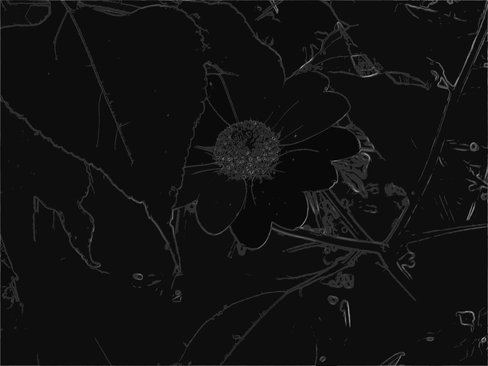

# ImageSegmentation

**Skoluppgift till kursen "Avancerade metoder för text och bildbehandling" (DA357A)**  
Kalle Bornemark - 861209-3917  
Jimmy Maksymiw - 891031-1730

---

## Programbeskrivning

Detta program är konstruerat i syfte att påöka våra kunskaper om hur man manipulerar bilder i Java. Användaren förses med följande funktionalitet:

  * Gråskala
  * Gaussian blur
  * Motions blur
  * Konturdetektering med Sobel-kärna
  * Segmentering med tröskelvärde

---

## Testfall

### Test 1.1: Segmentering med tröskelvärde
Målet med detta test är att se hur tydligt vi kan urskilja enskilda objekt från dess omgivning. Metoden skapar segment genom att gå igenom input-bildens alla pixlar för att sedan jämföra deras attribut med intilliggande grannar. En grannpixel adderas till ett segment om dess färgvärden är inom det utsatta intervallet (segThres).

De tröskelvärden som behöver sättas är:
* segThres: Hur stor skillnad det får vara i färgvärden inom samma segment
* segMin: Minimalt antal pixelar i samma segment för att en separat bild skall genereras
* segMax: Maximalt antal pixelar i samma segment för att en separat bild skall genereras

Förväntad utdata:

1. En bearbetad bild där segmenten är förtydligade med hjälp av tröskelvärden
2. Separata bilder för alla segment som uppfyller de satta storlekskraven

##### Indata
* Bild: 
  
* segThres: 70
* segMin: 300
* segMax: 10000

##### Resultat
1: Segmentering    
2: Dessutom genereras separata bilder för varje segment (enskilda glödlampor i detta fall). Två exempel:  
    

### Test 1.2: Segmentering med tröskelvärde (forts.)
Detta test är en förlängning av Test 1.1 och utförs därför på samma vis fast med annat tröskelvärde och storlek på segment.

##### Indata
* segThres: 120
* segMin: 2000
* segMax: 8000

##### Resultat
1: Segmentering    
2: Separata bilder för varje segment (enskilda glödlampor i detta fall). Två exempel:  
    

### Test 1.3: Segmentering med tröskelvärde (forts.)
Detta test är en förlängning av Test 1.1 och utförs därför på samma vis fast med annat tröskelvärde och storlek på segment.

##### Indata
* segThres: 100
* segMin: 1000
* segMax: 6000

##### Resultat
1: Segmentering    
2: Separata bilder för varje segment (enskilda glödlampor i detta fall). Två exempel:  
    

Med dessa tröskelvärden är vi nöjda med resultatet och går därför vidare till nästa test.

### Test 2: Gråskala och Gaussian Blur
Här testar vi omvandlingen till gråskala och appliceringen av Gaussian Blur.

Inga tröskelvärden behöver sättas.

Förväntad utdata:

1. Indatabild omgjord till gråskala
2. Ovanstående bild med applicerad Gaussian Blur

##### Indata
* Bild: 
  

##### Resultat
1: Gråskala 
  
2: Gaussian Blur 
  

### Test 3.1: Konturdetektering med Sobelkärna och förfining genom segmentering
Målet med detta test är att få fram tydliga konturer från resultatbilden i Test 2. Detta görs genom att applicera två Sobel-kärnor som itererar igenom samtliga pixlar i bilden (vertikalt och horisontellt). Sedan förfinas konturerna genom att köra bilden genom segmenteringsproceduren.

Två tröskelvärden behöver sättas:
* Räckviddströskel för pixelintensiteten, avgör hur stark intenitet varje pixel måste ha för att räknas som en kontur
* Ett tröskelvärde för hur stora färgskillnader pixlar får ha för att räknas in i samma segment 

Förväntad utdata:

1. Resultatbild från Test 2 med applicerad Sobel-kärna som framhäver konturerna
2. Ovanstående bild med förfinade konturer genom segmenteringsprocessen

##### Indata
* Bild: 
  
* sobelThres: 100
* segThres: 80

##### Resultat
1: Sobel 
  
2: Segmentering 
  

Bilden innehåller fortfarande en stor mängd brus och överflödig information som inte tillhör några betydelsefulla konturer. Vi fortsätter därför i nästa test med förfinade tröskelvärden.

### Test 3.2: Konturdetektering med Sobelkärna och förfining genom segmentering (forts.)
Detta test är en förlängning av Test 3.1 och utförs därför på samma vis fast med andra tröskelvärden.

##### Indata
* sobelThres: 65
* segThres: 100

##### Resultat
1: Sobel 
  
2: Segmentering 
  

Resultatet är nu bättre - en stor del av buskaget i bildens nedre region är borta. Vi är dock ännu inte helt nöjda och korrigerar därför tröskelvärdena ännu en gång.

### Test 3.3: Konturdetektering med Sobelkärna och förfining genom segmentering (forts.)
Detta test är en förlängning av Test 3.1 och utförs därför på samma vis fast med andra tröskelvärden.

##### Indata
* sobelThres: 20
* segThres: 130

##### Resultat
1: Sobel 
  
2: Segmentering 
  

Vi är nu nöjda med resultatet då bilden efter Sobel-filtret och segmentering visar tydliga vita konturer mot en relativt helsvart bakgrund.

### Test 4.1: Konturdetektering med Sobelkärna och förfining genom segmentering (forts.)
Med detta test vill vi visa på att lämpliga tröskelvärden för en bild inte nödvändigtvis fungerar för en annan.
Vi använder här samma tröskelvärden som fungerade utmärkt i föregående test (3.3).

##### Indata
* Bild: Denna bild är förbehandlad med gråskala och Gaussian Blur 

* sobelThres: 20
* segThres: 130

##### Resultat
1: Sobel 
  
2: Segmentering 
  

Med detta svaga resultat så korrigerar vi successivt trösklarna i nästkommande tester.

### Test 4.2: Konturdetektering med Sobelkärna och förfining genom segmentering (forts.)
Detta test är en förlängning av Test 4.1 och utförs därför på samma vis fast med andra tröskelvärden för att få ett bättre resultat.

##### Indata
* sobelThres: 100
* segThres: 70

##### Resultat
1: Sobel 
  
2: Segmentering 
  

### Test 4.3: Konturdetektering med Sobelkärna och förfining genom segmentering (forts.)
Detta test är en förlängning av Test 4.1 och utförs därför på samma vis fast med andra tröskelvärden för att få ett bättre resultat.

##### Indata
* sobelThres: 110
* segThres: 25

##### Resultat
1: Sobel 
  
2: Segmentering 
  

Blommans konturer är nu betydligt lättare att urskilja än de som resultatet av test 4.1 innehöll.

## Slutsats
